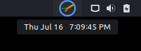

# OClock
This is a gnome shell extension to display an analog clock in the panel.

## Gnome-shell versions
* 40
* 41

## Install
### EGO (recommended)
Get it from [extensions.gnome.org](https://extensions.gnome.org/extension/3578/oclock/).

### From source
Run
```
./pack.sh
gnome-extensions install oclock@ortega.tech.shell-extension.zip
```
Then restart gnome-shell with <kbd>Alt</kbd>+<kbd>F2</kbd> and run `restart`.

## Screenshots
Using theme colors together with the normal clock.


Replacing the normal clock without second hand, bigger size and using [Notification Counter extension](https://extensions.gnome.org/extension/1386/notification-counter/).


Using custom colors, showing the label with the full date and time on hover and using [Frippery Move Clock](https://extensions.gnome.org/extension/2/move-clock/).


